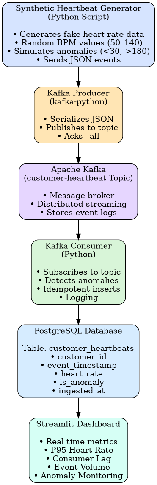
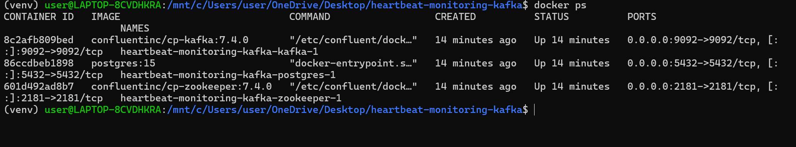
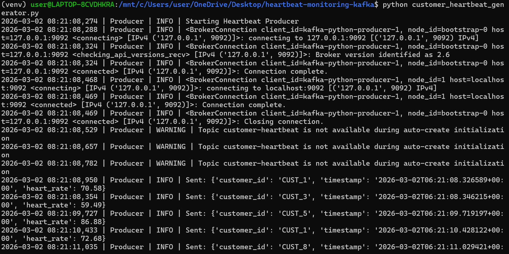
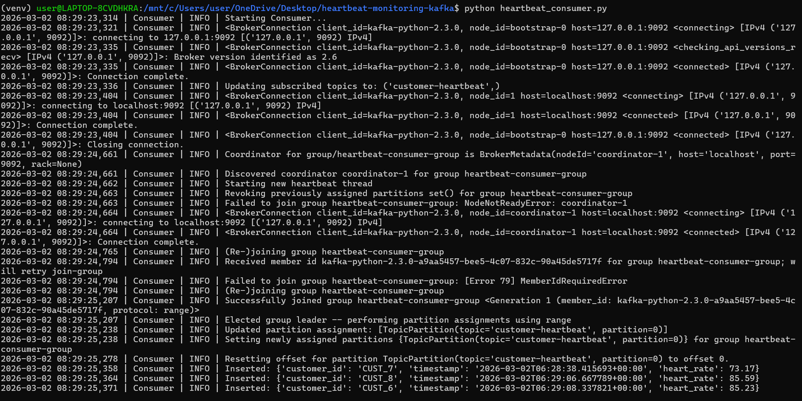
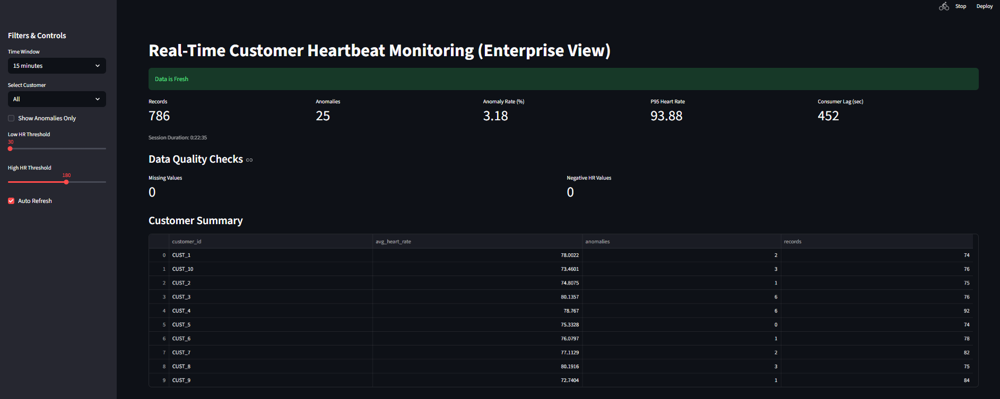
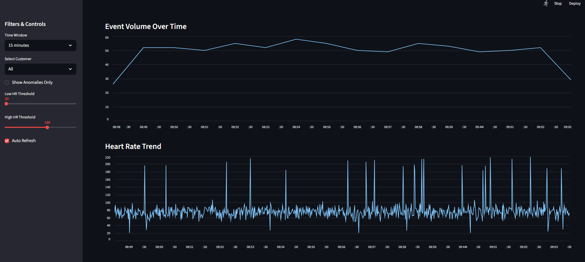
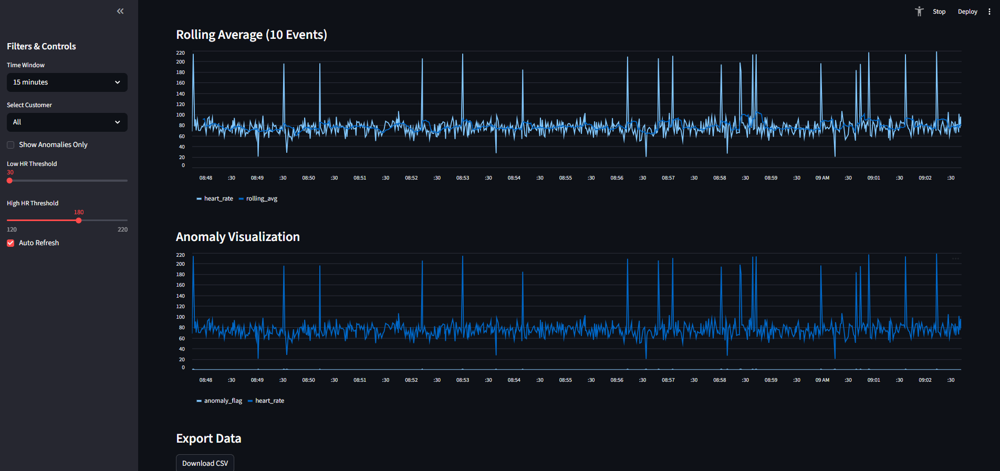

# Real-Time Customer Heartbeat Monitoring System

##  Project Overview

This project implements a real-time data engineering pipeline that simulates, streams, processes, stores, and visualizes customer heart rate data.

The system demonstrates core concepts including:

- Real-time data simulation
- Apache Kafka streaming
- Stream processing with consumers
- PostgreSQL time-series storage
- Data validation and anomaly detection
- Real-time dashboard visualization using Streamlit

This project simulates a production-grade streaming analytics system.

---

# System Architecture

##  Data Flow

Synthetic Data Generator  
        ⬇  
Kafka Producer  
        ⬇  
Kafka Topic (`customer-heartbeat`)  
        ⬇  
Kafka Consumer  
        ⬇  
PostgreSQL (`customer_heartbeats`)  
        ⬇  
Streamlit Dashboard  

---

##  Architecture Diagram



---

# Technology Stack

- **Python 3.12**
- **Apache Kafka**
- **Zookeeper**
- **PostgreSQL 15**
- **Docker & Docker Compose**
- **Streamlit**
- **Plotly**
- **psycopg2**

---

#  System Setup Instructions

## 1️. Start Infrastructure

```bash
docker compose up -d
````

Verify containers:

```bash
docker ps
```

---

## 2️. Run Data Producer

```bash
python customer_heartbeat_generator.py
```

This continuously generates synthetic heart rate data.

---

## 3️. Run Kafka Consumer

```bash
python heartbeat_consumer.py
```

The consumer:

* Reads Kafka messages
* Validates data
* Detects anomalies
* Inserts records into PostgreSQL

---

## 4️. Run Dashboard

```bash
streamlit run streamlit_dashboard.py
```

Open browser:

```
http://localhost:8501
```

---
#  Database Schema

Schema file: `schema.sql`

Table: `customer_heartbeats`

---

##  Table Definition

```sql
CREATE TABLE customer_heartbeats (
    id SERIAL PRIMARY KEY,
    customer_id VARCHAR(50) NOT NULL,
    event_timestamp TIMESTAMPTZ NOT NULL,
    heart_rate NUMERIC(5,2) NOT NULL,
    is_anomaly BOOLEAN DEFAULT FALSE,
    ingested_at TIMESTAMPTZ DEFAULT NOW(),
    CONSTRAINT unique_event UNIQUE (customer_id, event_timestamp)
);

CREATE INDEX idx_customer_id ON customer_heartbeats(customer_id);
CREATE INDEX idx_event_timestamp ON customer_heartbeats(event_timestamp);
````

---

##  Main Columns

* `id` (SERIAL) – Auto-increment primary key
* `customer_id` (VARCHAR(50)) – Unique identifier of the customer
* `event_timestamp` (TIMESTAMPTZ) – Timestamp when heart rate event occurred
* `heart_rate` (NUMERIC(5,2)) – Heart rate value in beats per minute (BPM)
* `is_anomaly` (BOOLEAN) – Indicates abnormal heart rate readings
* `ingested_at` (TIMESTAMPTZ) – Timestamp when record was inserted

---

##  Indexes & Constraints

* Unique constraint on `(customer_id, event_timestamp)` to prevent duplicate events
* Index on `customer_id` for faster customer-based filtering
* Index on `event_timestamp` for optimized time-series queries

---

##  Design Considerations

* `TIMESTAMPTZ` ensures timezone-aware timestamps for distributed systems
* `NUMERIC(5,2)` allows precise heart rate storage
* `is_anomaly` enables efficient anomaly monitoring
* Indexing improves dashboard performance and real-time analytics queries

---

#  Screenshots

---

##  Docker Containers Running



All services (Kafka, Zookeeper, PostgreSQL) running successfully via Docker Compose.

---

##  Kafka Producer Output



The producer continuously generates and publishes synthetic heart rate events.

---

##  Kafka Consumer Output



The consumer processes streaming data and inserts validated records into PostgreSQL.

---

##  Streamlit Dashboard – Real-Time Monitoring










---

#  Dashboard Interpretation & Analysis

The Streamlit dashboard provides real-time observability of the entire pipeline.

---

##  System Health Indicators

* **Records Processed:** Confirms active ingestion.
* **Consumer Lag:** Indicates Kafka-to-database delay.
* **Data Freshness Indicator:** Validates pipeline liveness.

This confirms the end-to-end streaming pipeline is functioning correctly.

---

##  Statistical Insights

* **P95 Heart Rate:** Represents the 95th percentile heart rate.
* **Anomaly Rate:** Percentage of abnormal heart rate readings.

This demonstrates real-time percentile analytics and anomaly monitoring.

---

##  Data Quality Checks

* Missing values = 0
* Negative heart rate values = 0

This confirms validation logic in the consumer is working properly.

---

##  Rolling Average Analysis

The 10-event rolling window smooths short-term fluctuations while preserving trend behavior.

Spikes represent simulated anomalies generated by the synthetic data script.

---

##  Event Volume Over Time

The volume chart confirms:

* Continuous streaming behavior
* Stable ingestion rate
* No pipeline downtime

---

##  Interactive Features

The dashboard includes:

* Time-window filtering (5m / 15m / 1h)
* Customer selection
* Adjustable anomaly thresholds
* Auto-refresh streaming updates
* CSV export functionality

This demonstrates production-style monitoring and observability design.

---

#  Conclusion

This project successfully implements a real-time customer heartbeat monitoring system from data simulation to visualization.

The system demonstrates modern data engineering architecture and streaming analytics concepts suitable for production environments.


